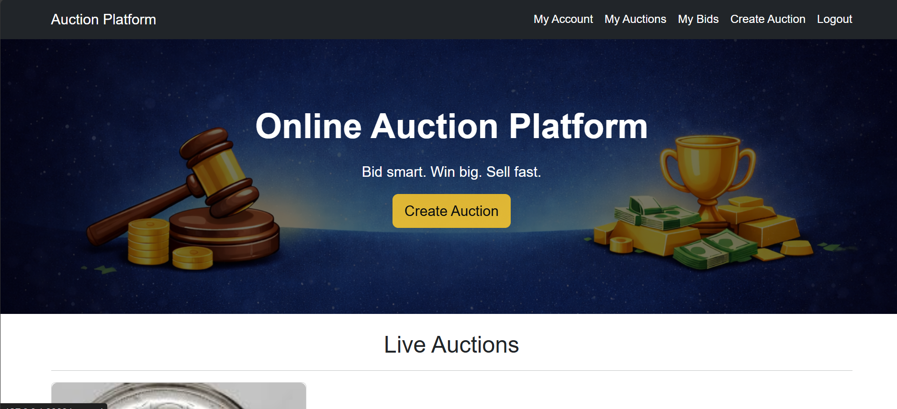
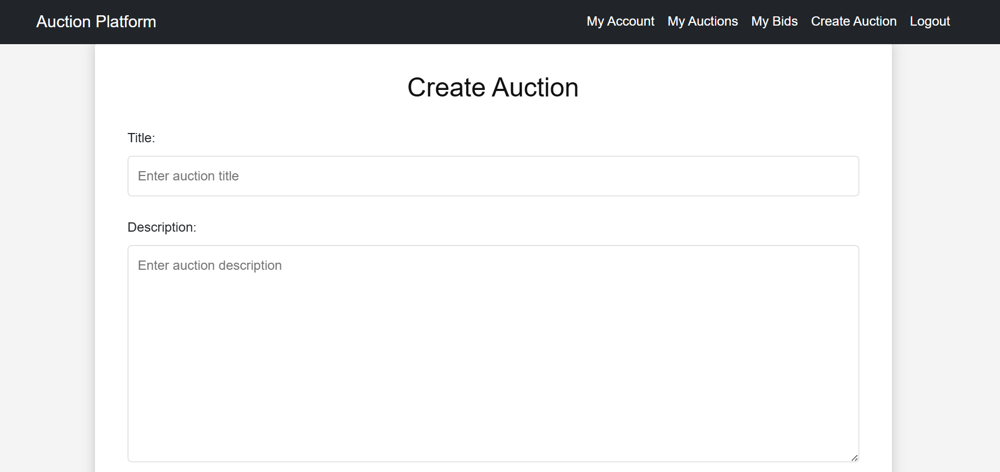
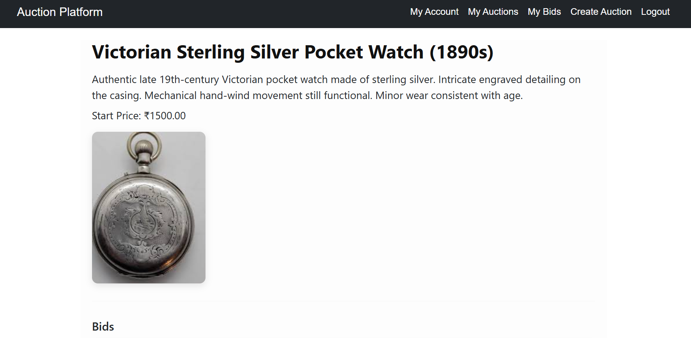
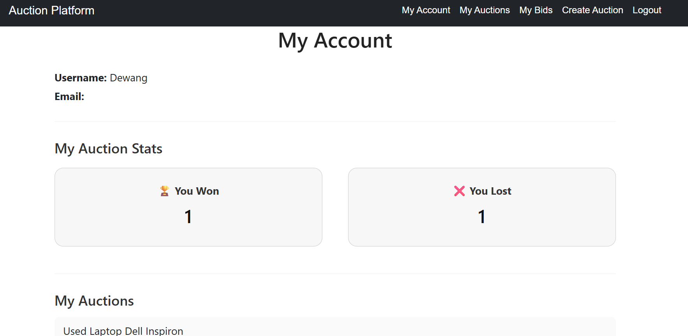

# 🏆 Django Auction Platform

A full-stack online auction platform built using Django and Django REST Framework.  
Users can create auctions, place bids, track wins and losses, and interact through a modern web interface.

---

## 🚀 Features

### User Features
- User registration and login
- User dashboard with statistics
- View won auctions
- View lost auctions
- Track bidding history

### Auction Features
- Create auction listings
- Upload auction images
- Set starting price and end time
- Automatic auction closing
- Automatic winner selection

### Bidding System
- Place bids on auctions
- Prevent invalid bids
- Outbid alert system
- Track bid history

### Admin Panel
- Manage users
- Manage auctions
- Manage bids
- Full Django admin control

### REST API
- View auctions via API
- Place bids via API
- Access user bid history via API

---

## 🖥 Screenshots

### Home Page


### Create Auction


### Auction Detail


### Dashboard


---

## 🛠 Tech Stack

Backend:
- Python
- Django
- Django REST Framework

Frontend:
- HTML
- CSS
- Bootstrap

Database:
- SQLite (Development)
- MySQL (Optional Production)

Tools:
- Git
- GitHub

---

## ⚙️ Installation & Setup

1. **Clone the repository**

```bash
git clone https://github.com/tanmaypansare/django-auction-platform.git
```

2. **Navigate to project folder**

```bash
cd django-auction-platform

```

3. **Create virtual environment (optional but recommended)**

```bash
python -m venv venv
```

4. **Activate virtual environment**

* Windows:

```bash
venv\Scripts\activate
```

* Linux / macOS:

```bash
source venv/bin/activate
```

5. **Install dependencies**

```bash
pip install -r requirements.txt
```

6. **Apply migrations**

```bash
python manage.py migrate
```

7.**Run server**

```bash
python manage.py runserver
```
---
## 🔌API Endpoints
```
| Endpoint                | Description    |
| ----------------------- | -------------- |
| /api/auctions/          | List auctions  |
| /api/auction/<id>/      | Auction detail |
| /api/bid/               | Place bid      |
| /api/my-bids/<user_id>/ | User bids      |

```
---
## 📂 Project Structure

```
auction_platform/
│
├── accounts/
├── auctions/
├── bids/
├── api/
├── templates/
├── static/
├── media/
├── manage.py

```
---

## 📌 Future Improvements
* Improved mobile responsiveness
* Dark / Light mode
* Email notifications
* Real-time bidding (WebSockets)
* Payment integration
* Deployment 

---
## 👨‍💻 Author

**Pansare Tanmay**
Aspiring Full Stack Developer | Python | IoT | Web Development

---
## ⭐ Support

If you like this project, don’t forget to **star ⭐ the repository**!
